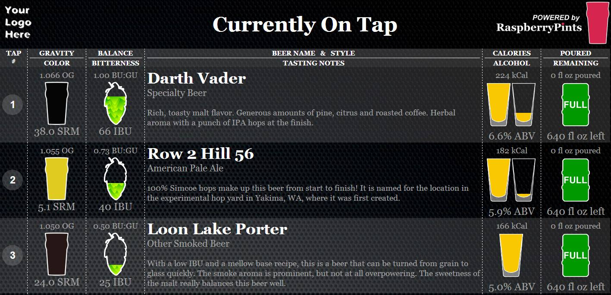
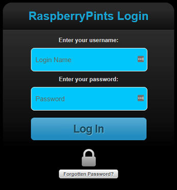
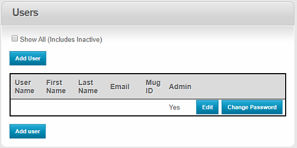

# Raspberrypints
 My installation of [raspberrypints](http://raspberrypints.com/) inkluding:
 * Flow meters
 * RFID security
 * Presence detection
 * Temperature probes
 
 So basically everything besides loadcells but that might change!

## Progress
- [x] [Install and config rpints](#install-and-configure-rpints)
- [x] Mount monitor
- [ ] Connect flow sensors to UNO
- [ ] Connect RFID reader to PI
- [ ] Connect PIR sensor to PI
- [ ] Have a beer!

    ## Install and config rpints
    This turned out to be easier then I had expected, and at the same time more confusing. Reading the [docs](http://raspberrypints.com/byo/) it's 9 different steps if done with flow meters and most of it is coding, changing settings and installing packages!

    Well someone over at the [homebrewtalk forum](https://support.rpints.com/) made it a whole lot easier for everyone. I just installed the latest OS with raspberrys own tool, opened a terminal and entered: `curl -L install.rpints.com | sudo bash`

    That led me straight through a bunch of options, did I want to use flow meters yes/no, install sample data etc.

    A quick reboot later and I could browse to the IP of the Pi and there it was, filled with example information and looking groovy already!

    

### Configuration
So, first question was how to get to the admin panel... See that _"Your Logo Here"_ sign in the top left... click that!

Now you should see a page like this: 
 

I tried the usual combination of admin/admin, admin/blank, root/root etc but to save anyone who reads this the pain just press **Log in** and leave both fields empty.

My suggestion is that the first thing you do is head over to the left side menu and **Drinker accounts** where you can click change password: 

